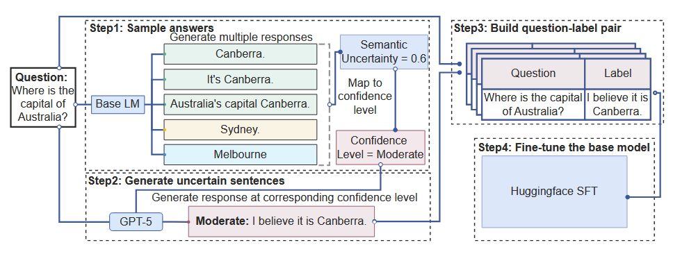
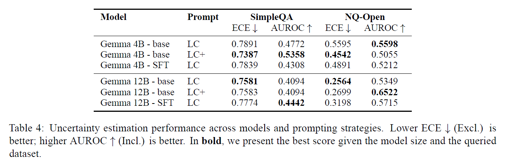
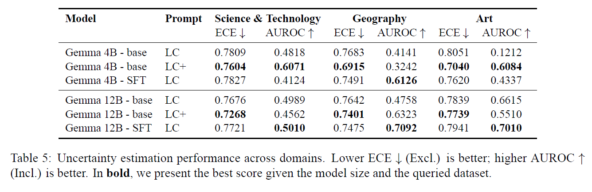
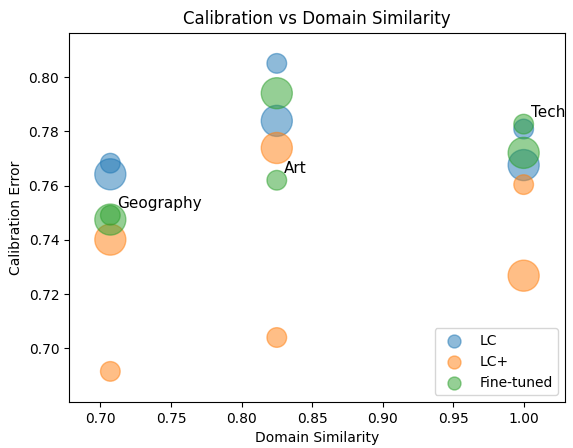
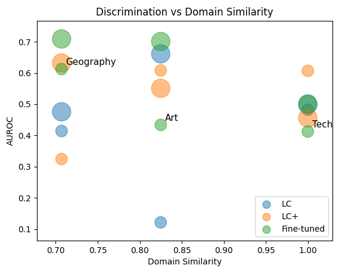

# Improving-Uncertainty-Communication-in-LLMs
The following scripts provide instructions for fine-tuning and replicating the test described in our [Report](Report.pdf). 

The project follows the [Can Large Language Models Express Uncertainty Like Human?](https://arxiv.org/abs/2509.24202v1) framework shown below:




## How to Run

---
#### Generate SU scores
```bash
bash extract_su.sh
```

---
#### Select 200 samples for fine-tuning
You need to provide the model size as an argument. Example: gemma-12b-it
```bash
python evaluating_LC/get_200_q.py $model_size
```
#### Rephrasing
There is no single script, but you can check the [APIcalls](notebooks/APIcalls.ipynb) notebook, section "Rephrasing with uncertainty" for an example of how to rephrase the questions and produce fine-tuning sets.

---
#### Fine-tune gemma3 models

```bash
bash finetune_script.sh
```

#### Generate answers
```bash
bash domain_experiments.sh
```

#### Grading answers
Check the [APIcalls](notebooks/APIcalls.ipynb) notebook, section "Get accuracy" for details on how to grade the answers produced in the previous step.

---
#### Calculate scores
Make sure that the graded files are in evaluating_LC\outputs\LC_outputs\results before running the command
```bash
bash calculate_results.sh
```

#### Generate figures
The scores are hardcoded inside the script. If you want to see your test results, change the values inside before running the script to generate accurate plots. 
```bash
python domain_similarity.py
```
## Our results




