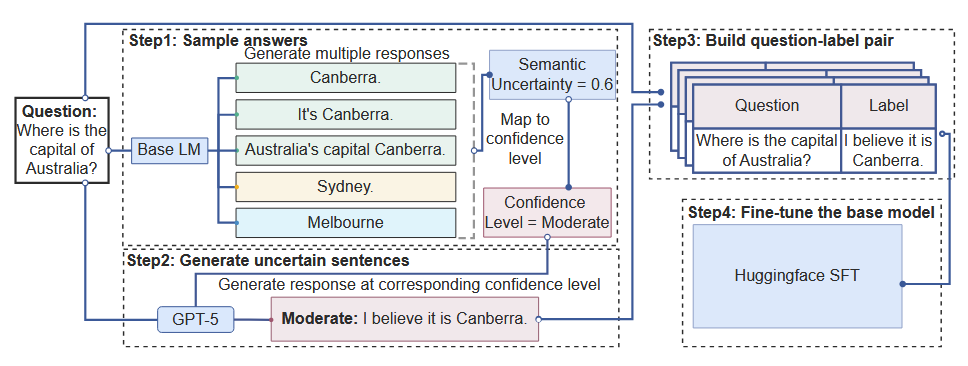
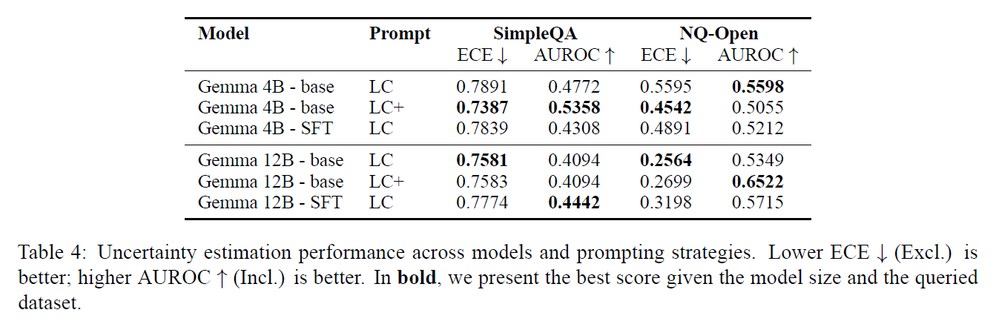
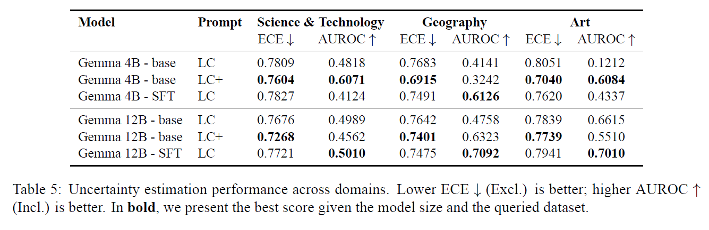
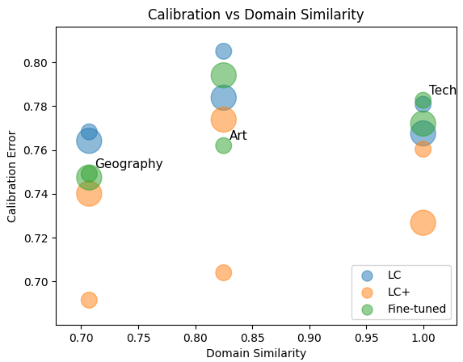
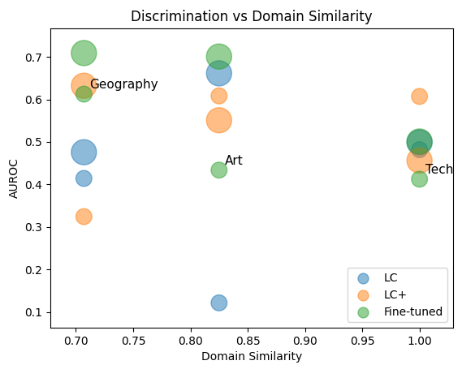

# Uncertainty Communication in LLMs

**Can fine-tuning improve calibration in question answering?**

A Bachelor's thesis investigating whether supervised fine-tuning can teach Large Language Models to express uncertainty the way humans do — through natural linguistic hedging rather than numeric confidence scores.

<!-- TODO: add badges once you've decided on a license and Python version -->
<!--   -->

📄 **[Full report](Report.pdf)** · 🤗 **Fine-tuned adapters:** [`gemma-3-4b-uncertain-s-t`](https://huggingface.co/pashadohnal/gemma-3-4b-uncertain-s-t) · [`gemma-3-12b-uncertain-s-t`](https://huggingface.co/pashadohnal/gemma-3-12b-uncertain-s-t)

---

## Overview

LLMs hallucinate, and users have few reliable signals for telling a grounded answer from a fabricated one. The problem is compounded by the conversational framing of chat assistants: a fluent, confident-sounding answer is trusted more, regardless of its accuracy.

Most existing work elicits uncertainty **numerically** ("I am 70% confident") or through prompting alone. Both approaches have drawbacks — numeric confidence is unnatural in conversation, and prompting is unreliable for calibration. This project instead targets **anthropomimetic uncertainty**: getting the model to hedge in plain language, the way a person would, while keeping that hedging *calibrated* to the model's actual likelihood of being correct.

**Approach.** We build confidence-labelled fine-tuning data from the baseline models themselves, then measure whether fine-tuning on it improves calibration and discriminability:

1. Estimate each model's *true* uncertainty per question using **Semantic Uncertainty (SU)** — sample the model 10× and measure agreement across semantic clusters.
2. Use SU to bucket questions into five confidence levels, then have a panel of external LLMs rephrase the gold answers with hedging appropriate to each level.
3. Fine-tune Gemma 3 (4B and 12B) on the resulting datasets with LoRA + 8-bit quantisation.
4. Evaluate on held-out and out-of-domain question sets, scoring the *linguistic* confidence of each answer with a trained regression head and comparing it against grading-based accuracy.



The pipeline follows the framework of [*Can Large Language Models Express Uncertainty Like Human?*](https://arxiv.org/abs/2509.24202v1).

### Experimental conditions

| Condition | Description |
|---|---|
| `lc` | Baseline model, standard answering prompt |
| `lc_plus` | Baseline model, prompt explicitly asking it to hedge when uncertain |
| `fine_tuned` | LoRA-adapted model trained on our confidence-labelled data |

Each condition is run across five question sets (SimpleQA overall, science & technology, art, geography, and NQ-Open) and both model sizes — 30 evaluation runs in total.

---

## Key findings

- Fine-tuning for uncertainty expression **does not reliably improve calibration** (ECE).
- Fine-tuning **does show more consistent improvement in discriminability** (AUROC) — the models get better at ranking answers they're likely to get right above ones they aren't, even when absolute confidence remains miscalibrated.
- We found **no meaningful relationship** between train/test domain similarity and post-fine-tuning changes in either metric, despite isolating question topics to test for it.

See the [report](Report.pdf) for full discussion.

---

## Repository structure

```
.
├── evaluating_LC/                  Uncertainty estimation & evaluation
│   ├── bin/
│   │   ├── su_script.py            Semantic Uncertainty via 10× sampling
│   │   ├── linguistic_confidence.py  Answer generation + LC scoring
│   │   ├── get_scores.py           Metric aggregation
│   │   └── metrics/                Accuracy, ECE, AUROC implementations
│   ├── datasets/                   SimpleQA and NQ-Open evaluation splits
│   ├── pretrained_weights/         Regression head trained on human annotations
│   ├── outputs/                    Generated answers, gradings, and scores
│   ├── extract_su.sh               Step 1
│   ├── get_200_q.py                Step 2
│   ├── domain_experiments.sh       Step 4
│   └── calculate_results.sh        Step 6
├── imroving-llm-confidence/        LoRA fine-tuning (Hydra + TRL)
│   ├── _main_.py                   SFT training entrypoint
│   ├── configs/mapper/             Per-model-size training configs
│   ├── datasets/                   Generated confidence-labelled training sets
│   └── finetune_script.sh          Step 3
├── notebooks/APIcalls.ipynb        Answer rephrasing and LLM-as-judge grading
├── domain_similarity.py            Domain embedding similarity + figures
├── figures/
└── Report.pdf
```

---

## Getting started

### Requirements

- Python 3.10+
- A CUDA GPU. The 12B model is loaded in 8-bit and fine-tuned with LoRA; Experiments were run on a single A100 40GB
- A [Hugging Face token](https://huggingface.co/settings/tokens) with access to the gated Gemma 3 models
- An [OpenRouter](https://openrouter.ai/) or other API service for the rephrasing and grading steps.

```bash
git clone https://github.com/kfkfkflmej/Improving-Uncertainty-Communication-in-LLMs.git
cd Improving-Uncertainty-Communication-in-LLMs

python -m venv .venv && source .venv/bin/activate
pip install -r requirements.txt

export HF_TOKEN="your_token_here"
export OPENROUTER_API_KEY="your_key_here"
```

### Data

<!-- TODO: describe the source datasets here — SimpleQA and NQ-Open — with links, licenses, and how the topic-specific splits (art / geography / science & technology) were derived. -->

---

## Running the pipeline

All commands are run from the repository root.

### 1. Estimate semantic uncertainty

Samples each baseline model 10× per question and clusters responses semantically to derive a ground-truth confidence level.

```bash
bash evaluating_LC/extract_su.sh
```

### 2. Build the balanced fine-tuning question set

Selects 40 questions from each of the five confidence levels. Pass the model size as an argument.

```bash
python evaluating_LC/get_200_q.py gemma-3-4b-it
python evaluating_LC/get_200_q.py gemma-3-12b-it
```

### 3. Generate hedged answers

Open [`notebooks/APIcalls.ipynb`](notebooks/APIcalls.ipynb) → **Rephrasing with uncertainty**. Each question's gold answer is rephrased ten ways at the target confidence level by a panel of external models, producing the training CSVs in `imroving-llm-confidence/datasets/`.

### 4. Fine-tune

LoRA adapters over 8-bit Gemma 3, configured via Hydra.

```bash
bash imroving-llm-confidence/finetune_script.sh
```

### 5. Generate evaluation answers

Runs all three conditions across both model sizes and all five question sets, scoring each answer's linguistic confidence with the trained regression head.

```bash
bash evaluating_LC/domain_experiments.sh
```

### 6. Grade the answers

Open [`notebooks/APIcalls.ipynb`](notebooks/APIcalls.ipynb) → **Get accuracy**. Answers are graded `CORRECT` / `INCORRECT` / `NOT_ATTEMPTED` by an LLM judge against the gold targets. Place the graded files in `evaluating_LC/outputs/LC_outputs/results/`.

### 7. Compute metrics

```bash
bash evaluating_LC/calculate_results.sh
```

Writes accuracy, ECE, and AUROC for every run to `evaluating_LC/outputs/LC_outputs/scores/scores.jsonl`.

### 8. Generate figures

```bash
python domain_similarity.py
```

> **Note:** The score values used for plotting are hardcoded in this script. Update them with your own results before running, or the plots will reproduce ours.

---

## Metrics

| Metric | What it measures |
|---|---|
| **Accuracy** | Share of attempted answers graded correct |
| **ECE** (Expected Calibration Error, 10 bins) | Gap between expressed confidence and empirical accuracy — *is the hedging honest?* |
| **AUROC** | How well expressed confidence separates correct from incorrect answers — *is the hedging informative?* |

Linguistic confidence is extracted with a sigmoid regression head over a sentence encoder, trained on human annotations (`evaluating_LC/pretrained_weights/human_anno_trained_reg_head.pth`), mapping a hedged sentence to a scalar in [0, 1].

---

## Results

**Effect of model size**



**Effect of evaluation domain**



**Domain similarity vs. calibration**



**Domain similarity vs. discriminability**



---

## Limitations

- Baseline accuracy on SimpleQA-style questions is low for models of this size, which compresses the range over which calibration can meaningfully be assessed.
- Grading depends on an LLM judge rather than human annotation.
- Domain splits are derived from SimpleQA topic metadata and are not balanced for difficulty.

---

## Authors

- **Dimitar Kochev** — diko@itu.dk
- **Pavel Dohnal** — pavd@itu.dk

Bachelor's thesis, IT University of Copenhagen.

Program: Data Science

Supervisor: [Christian Hardmier](https://christianhardmeier.rax.ch/)


## Acknowledgements

This work builds on the framework introduced in [*Can Large Language Models Express Uncertainty Like Human?*](https://arxiv.org/abs/2509.24202v1).
